# 3D Modeling And Animation (as a Hobby)

## Ninja Panther (New: 22/07/2020)

### Rigged with Bones, Also model skin can change by applying Wireframe modifier.

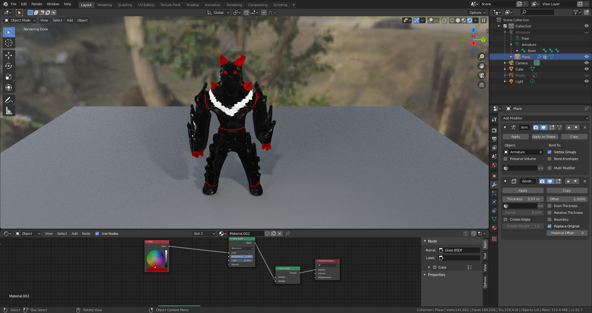 
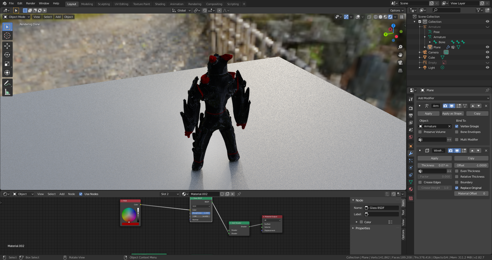 
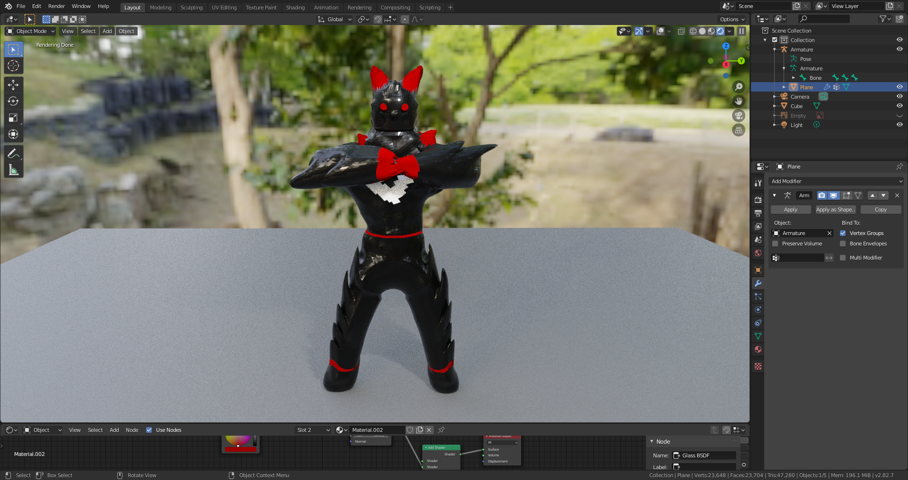 

### Wireframe and Bones of Ninja Panther:

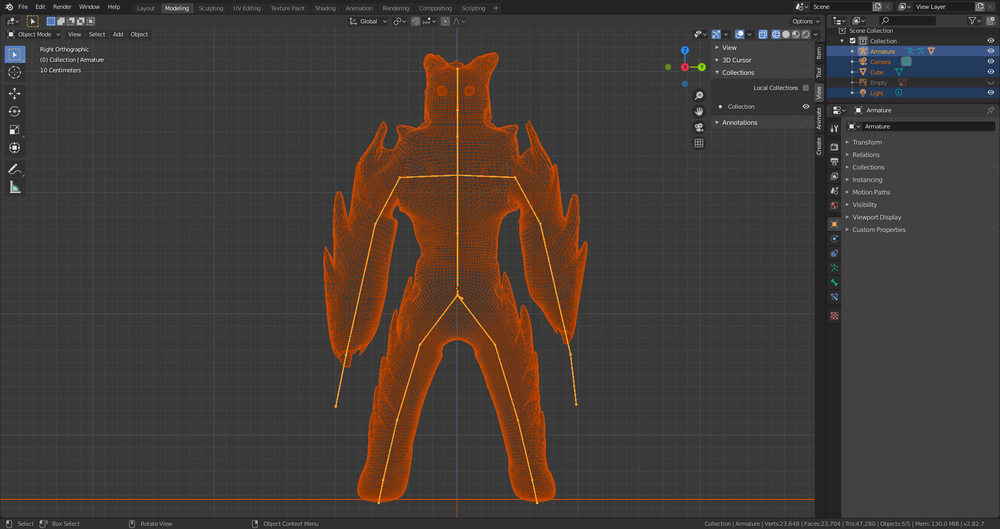 

## Forest Creatures 

### Particle Effects and Hair Components have been used in Project. Also added Rig for all parts (Tail, Arm, Chest, Neck, Ears, etc.)

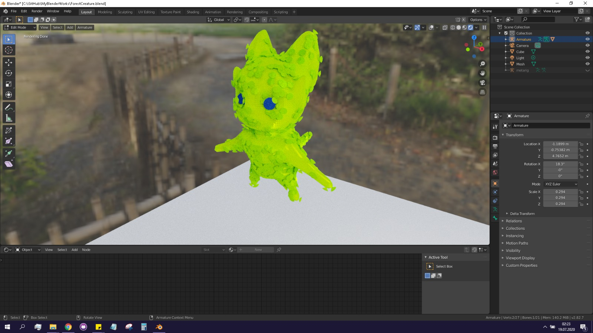 
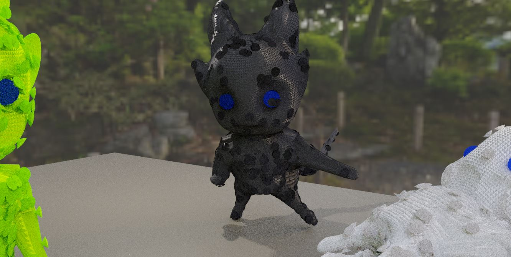 
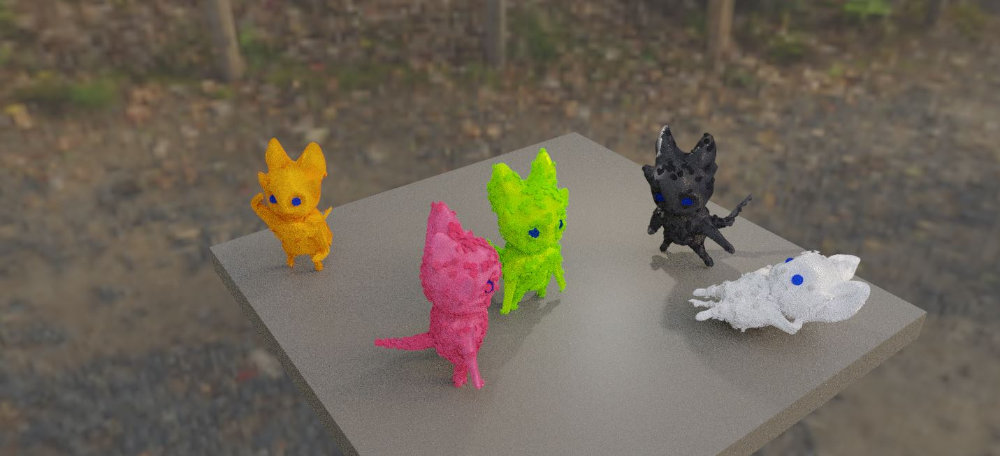 

---

## Infinity Gauntlet

### I used Visual Programming via Node Editor to look stones shiny crystalline, I also added Rig to allow for moving fingers freely.

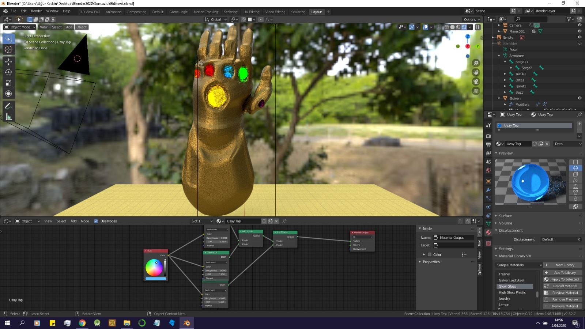 
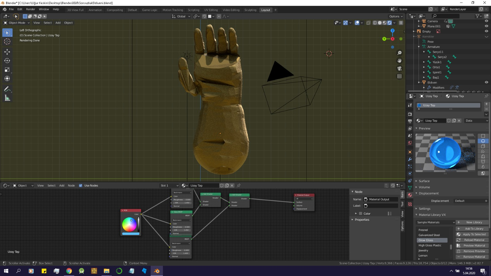 
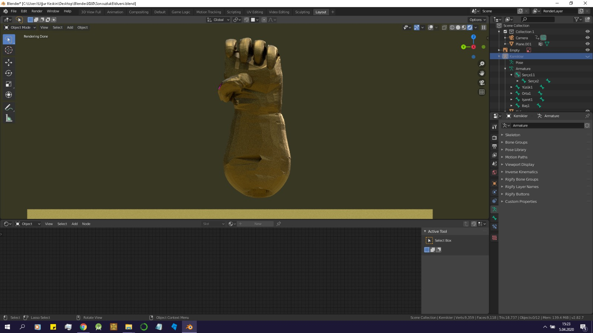 
---

## Wheel

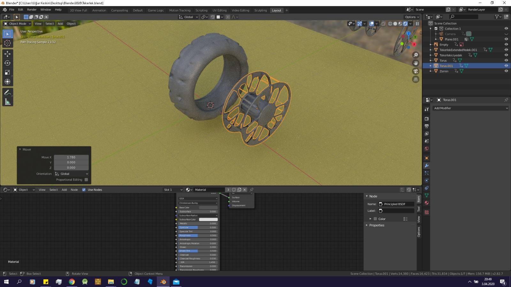 
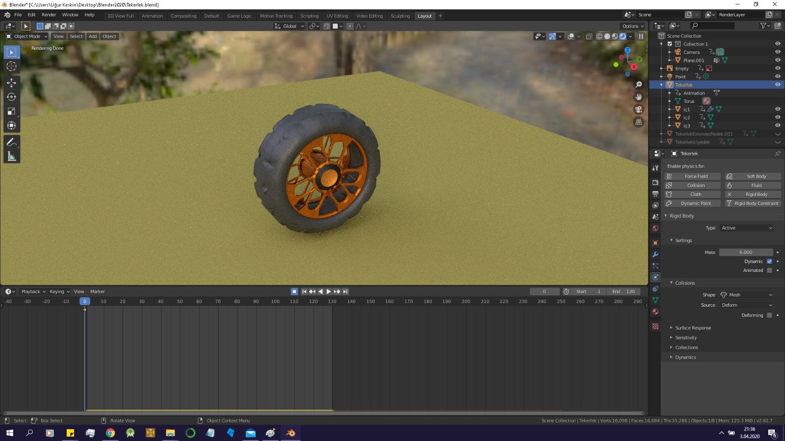 

## Animated 3D Models
 
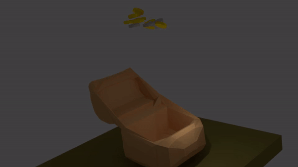 
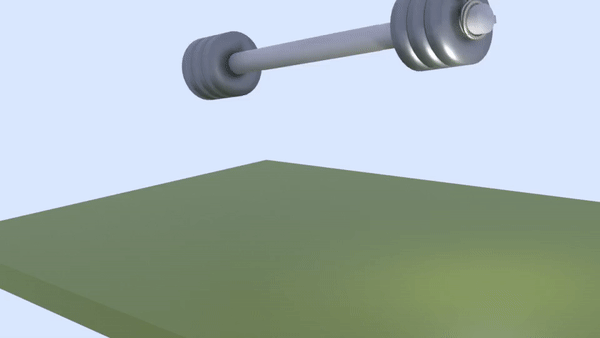 
